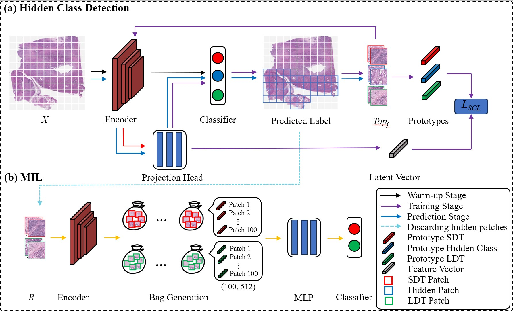

## HID-CON: Weakly Supervised Intrahepatic Cholangiocarcinoma Subtype Classification of Whole Slide Images using Contrastive Hidden Class Detection 
By [Jing Wei Tan](https://scholar.google.com/citations?user=_PMI46gAAAAJ&hl=en),  Kyoungbun Lee and  [Won-Ki Jeong](https://scholar.google.com/citations?user=bnyKqkwAAAAJ&hl=en&oi=sra)

[Paper](https://www.spiedigitallibrary.org/journals/journal-of-medical-imaging/volume-12/issue-6/061402/HID-CON--weakly-supervised-intrahepatic-cholangiocarcinoma-subtype-classification-of/10.1117/1.JMI.12.6.061402.full)
<p align="center">
  
</p>


### Abstract
**Purpose:**
Biliary tract cancer, also known as intrahepatic cholangiocarcinoma (IHCC), is a rare disease that shows no clear symptoms during its early stage, but its prognosis depends highly on the cancer subtype. Hence, an accurate cancer subtype classification model is necessary to provide better treatment plans to patients and to reduce mortality. However, annotating histopathology images at the pixel or patch level is time-consuming and labor-intensive for giga-pixel whole slide images. To address this problem, we propose a weakly supervised method for classifying IHCC subtypes using only image-level labels.
**Approach:**
The core idea of the proposed method is to detect regions (i.e., subimages or patches) commonly included in all subtypes, which we name the “hidden class,” and to remove them via iterative application of contrastive loss and label smoothing. Doing so will enable us to obtain only patches that faithfully represent each subtype, which are then used to train the image-level classification model by multiple instance learning (MIL).
**Results:**
Our method outperforms the state-of-the-art weakly supervised learning methods ABMIL, TransMIL, and DTFD-MIL by ∼17%, 18%, and 8%, respectively, and achieves performance comparable to that of supervised methods.
**Conclusion:**
The introduction of a hidden class to represent patches commonly found across all subtypes enhances the accuracy of IHCC classification and addresses the weak labeling problem in histopathology images.

## Framework 
Tensorflow 2

## Preprocessing
1. Download the raw WSI data.
2. Prepare the patches.
3. Store all the patches directory in a .csv file.

## Training
**Warm-up Stage**
```python
 CUDA_VISIBLE_DEVICES=0 python patchfeature_extraction.py --dir svs_directory 
```
The checkpoint can be downloaded from [here](https://huggingface.co/jingwei92/HID-CON/tree/main).

## Patch Label Prediction

## Patch Filtering

## Bag Feature Generation

## Bag Classification with MIL


## Inference
   The 'best_aver.npy' should be first downlaoded from this page first.
```python
 python inference.py --model_path .../best.hdf5 --input_file ../xx.csv --save_path /xxx/xxx --aver_path .../best_aver.npy
```
